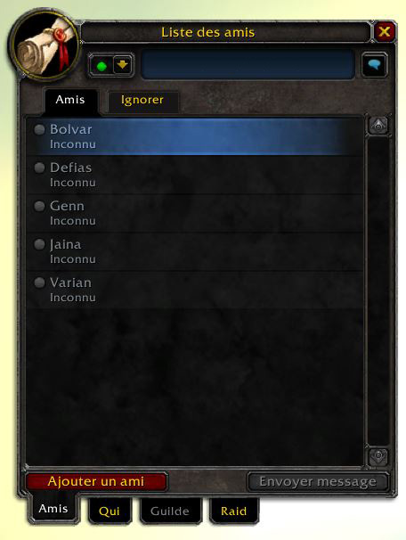

# HideBattleNetFriends

A lightweight World of Warcraft addon that hides all Battle.net (Real ID and BattleTag) friends from your in-game friends list. Only your character-level WoW friends remain visible.

## Why?

- **Streaming & content creation** - Prevents accidental display of real names and BattleTags on stream or in screenshots.
- **Cleaner friends list** - See only your WoW friends from the same server/faction, without the clutter of cross-game Battle.net contacts.
- **Privacy** - Keep your Battle.net social graph private while still playing normally.

## How it works

The addon overrides `BNGetNumFriends()` to return zero, so the WoW friends UI simply sees no Battle.net friends to display. That's it - 4 lines of Lua.

Nothing is deleted or modified server-side. You can still:
- Receive and reply to Battle.net whispers
- Send and accept Battle.net friend requests
- See your Battle.net friends in the Battle.net app

## Compatibility

| Client | Supported |
|---|---|
| Retail (The War Within / Midnight) | Yes |
| Classic (Cataclysm / MoP) | Yes |
| Classic Era | Yes |
| Anniversary Edition | Yes |

Interface versions are automatically kept up to date via CI.

## Installation

### From CurseForge
Install via [CurseForge](https://www.curseforge.com/wow/addons/hidebattlenetfriends) or any CurseForge-compatible addon manager (CurseForge app, WowUp, etc.).

### From GitHub Releases
1. Download `HideBattleNetFriends.zip` from the [latest release](https://github.com/Metalhearf/HideBattleNetFriends/releases/latest).
2. Extract the `HideBattleNetFriends` folder into your WoW addons directory:
   - **Windows:** `C:\Program Files (x86)\World of Warcraft\_retail_\Interface\AddOns\`
   - **macOS:** `/Applications/World of Warcraft/_retail_/Interface/AddOns/`
3. Restart WoW or type `/reload` in-game.

### Manual
Clone this repository and copy (or symlink) the `HideBattleNetFriends/` folder into your AddOns directory.

## Screenshot

*Friends list with the addon enabled: only WoW character friends are shown.*

## Contributing

Contributions are welcome! Feel free to open issues or submit pull requests.

## License

This project is licensed under the [GNU General Public License v3.0](LICENSE).
